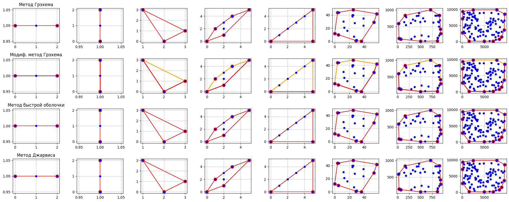

# Computational Geometry

**Алгоритмы вычислительной геометрии: построение выпуклой оболочки**

В этом репозитории собраны реализации основных алгоритмов построения выпуклой оболочки на плоскости и сравнение их производительности.

---

## 📚 Оглавление

- [Описание проекта](#project)
- [Реализованные алгоритмы](#algorithms)
- [Результаты производительности](performance)
- [Требования](#requirements)
- [Установка](#installation)
- [Использование](#using)
- [Структура репозитория](#structure)
- [Примеры](#demonstration)

---

## 📖 Описание проекта <a name="project"></a>

Проект содержит реализации классических алгоритмов построения выпуклой оболочки для набора точек на плоскости. Цель — продемонстрировать принципы работы, сравнить асимптотику и эмпирическую скорость на одинаковых данных.

---

## 🛠️ Реализованные алгоритмы  <a name="algorithms"></a>

- **Graham Scan** (`graham_scan.py`)
  - Опорная точка и сортировка по полярному углу.
  - Построение оболочки с помощью стека: добавление и удаление точек для обеспечения выпуклости.
  - Сложность: O(n log n).

- **Модифицированный Graham Scan** (`graham_scan_mod.py`)
  - Включает предварительную фильтрацию точек внутри ориентированного многоугольника.
  - Снижает число точек перед сортировкой, ускоряя практическую работу алгоритма.
  - Сложность: O(n log n), но с меньшим константным множителем.

- **Quick Hull** (`quick_hull.py`)
  - Разделяй и властвуй: находим две крайние точки и рекурсивно строим оболочку для точек по обе стороны.
  - На каждом шаге выбирается точка с максимальным удалением от ребра для «отсечения» точки.
  - Средняя сложность O(n log n), худшая — O(n²).

- **Jarvis March (алгоритм подарочной обёртки)** (`jarvis_march.py`)
  - Инициализация от крайней левой точки и последовательный выбор «следующей» по минимальному полярному углу.
  - Прямой обход всех точек для каждого ребра оболочки.
  - Сложность O(nh), где h — число точек на оболочке.

---

## 📊 Результаты производительности <a name="performance"></a>

| Алгоритм             | Суммарное время (с) | Среднее время выполнения (с) |
| -------------------- | ------------------- | ---------------------------- |
| Graham Scan          | 169.49756           | 0.16950                      |
| Graham Scan (модиф.) | 225.15862           | 0.22516                      |
| Quick Hull           | 1831.58011          | 1.83158                      |
| Jarvis March         | 718.12377           | 0.71812                      |

> Сводка по времени работы алгоритмов на заданных наборах точек.

---

## 🎯 Требования <a name="requirements"></a>

- Python 3.10+
- Библиотеки (из `requirements.txt` или устанавливаются вручную):
  - `numpy`
  - `matplotlib`

---

## 📥 Установка <a name="installation"></a>

```bash
# Клонируем репозиторий
git clone https://github.com/CaphAlderamin/Computational_Geometry.git
cd Computational_Geometry

# Создаем виртуальное окружение conda
conda create -n compgeom python=3.10 -y
conda activate compgeom

# Устанавливаем зависимости
pip install -r requirements.txt
```

---

## 💻 Использование  <a name="using"></a>

1. Запустите Jupyter Notebook или любой другой интерпретатор Python поддерживающий формат Notebook.
2. Откройте файл `SLAM_CPD.ipynb` и выполните все ячейки по порядку.

---

## 📂 Структура репозитория <a name="structure"></a>

```
Computational_Geometry/
├─ data/                   # Наборы точек для тестирования
├─ graham_scan.py          # Реализация Graham Scan
├─ graham_scan_mod.py      # Модифицированный Graham Scan
├─ quick_hull.py           # Реализация Quick Hull
├─ jarvis_march.py         # Реализация Jarvis March
├─ examples.ipynb          # Демонстрация работы алгоритмов
├─ requirements.txt        # Зависимости проекта
└─ README.md               # Описание проекта
```

---

## 🎥 Пример работы алгоритмов <a name="demonstration"></a>



---


